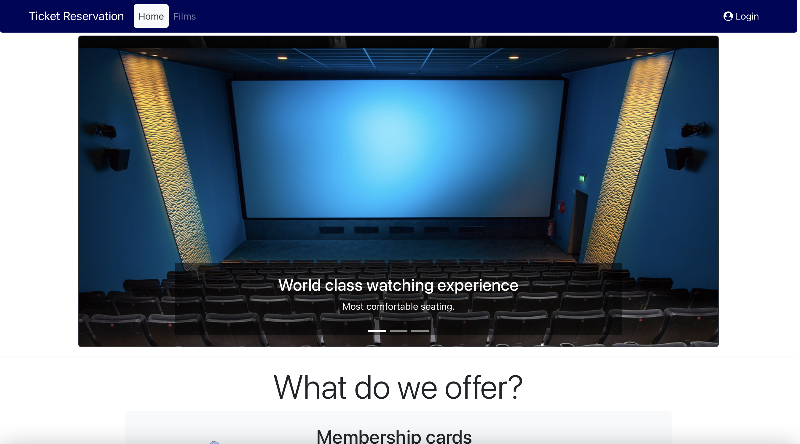
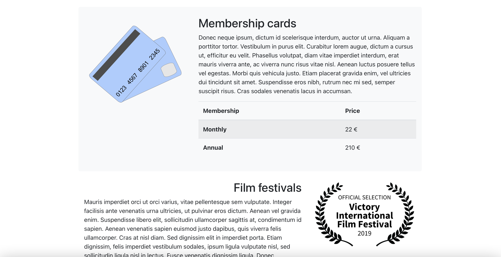
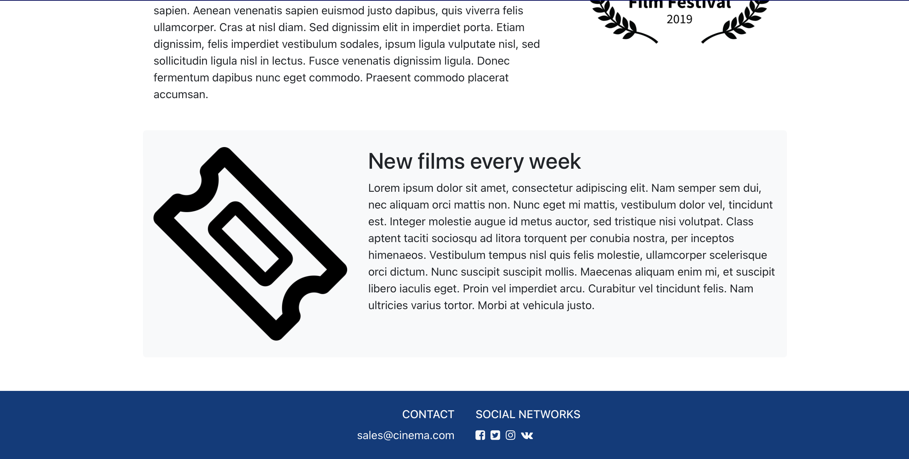
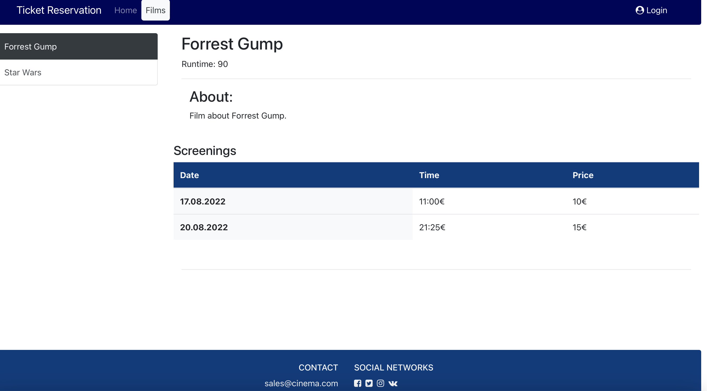
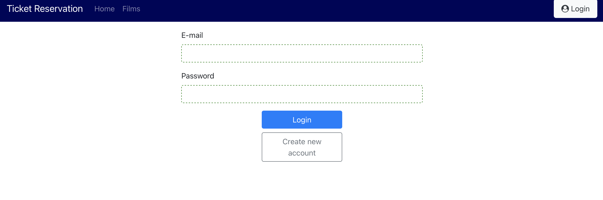
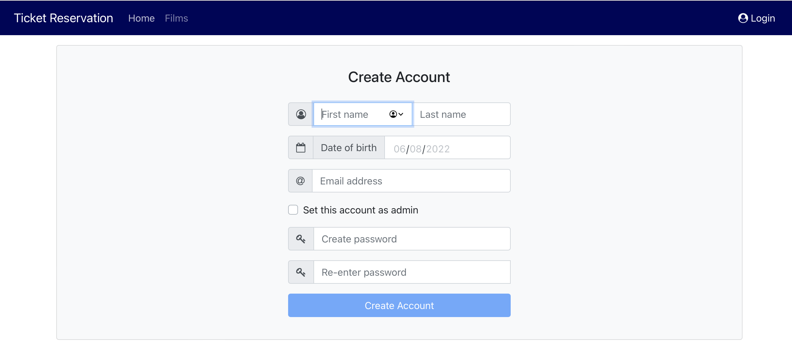
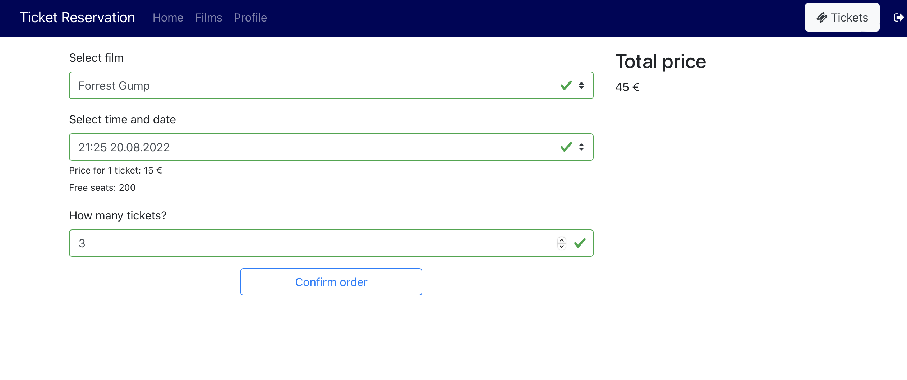
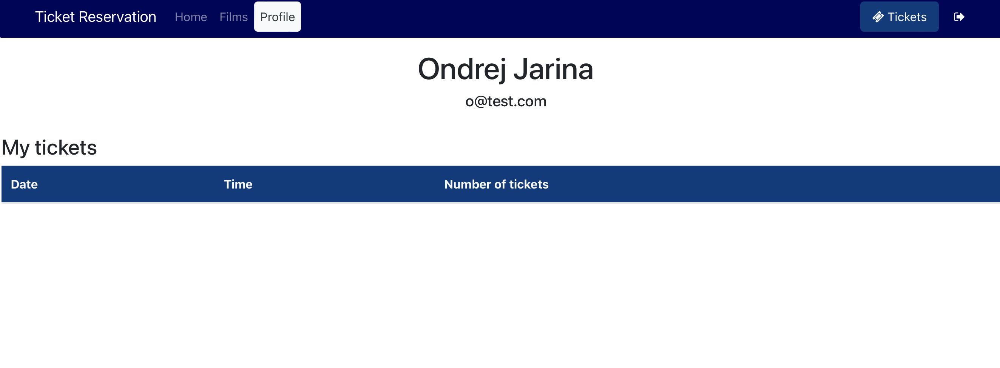
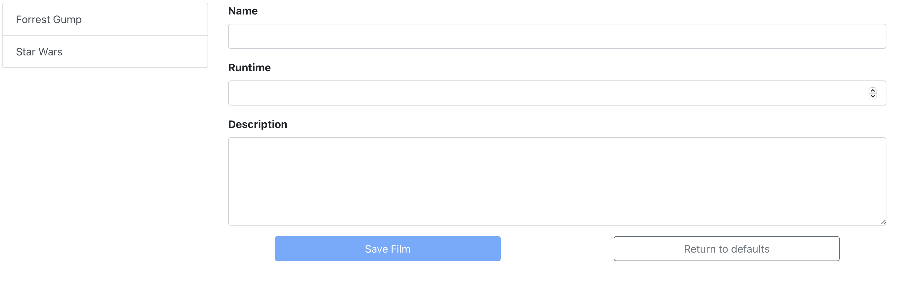

# Reservations

This app works as a front-end for Reservations Backend application.

It is written in **Angular**, a _javascript_ framework. **Bootstrap** is used as a _css_ framework.

Application works as a online reservation system for movie cinemas. Users can register/log in and reserve tickets for movies.

## Functionality
### Homescreen

### List of films

### User login

### User register

Account can be set as administrator, or not. Administrator can add new films, or add screenings of film.

### Ticket reservations

On this screen, user can order tickets. It will be limited by free seats in the cinema. User will see the total price before order.

### User profile

In the user profile section, the username, e-mail and all the reserved tickets are visible.

### Add new film

Only administrator can add new films.

